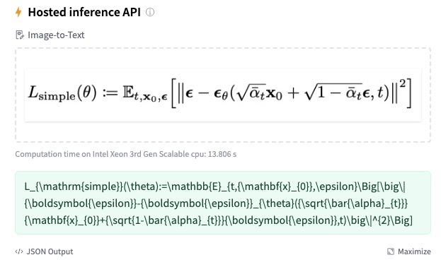

# Nougat-LaTeX-OCR



Nougat-LaTeX-based is fine-tuned from [facebook/nougat-base](https://huggingface.co/facebook/nougat-base) with [im2latex-100k](https://zenodo.org/record/56198#.V2px0jXT6eA) to boost its proficiency in generating LaTeX code from images. 
Since the initial encoder input image size of nougat was unsuitable for equation image segments, leading to potential rescaling artifacts that degrades the generation quality of LaTeX code. To address this, Nougat-LaTeX-based adjusts the input resolution and uses an adaptive padding approach to ensure that equation image segments in the wild are resized to closely match the resolution of the training data.
Download the model [here](https://huggingface.co/Norm/nougat-latex-base) 👈🏻.


## Evaluation
Evaluated on an image-equation pair dataset collected from Wikipedia, arXiv, and im2latex-100k, curated by [lukas-blecher](https://github.com/lukas-blecher/LaTeX-OCR#data)

|model| token_acc ↑ | normed edit distance ↓ |
| --- | --- | --- |
|pix2tex| 0.5346 | 0.10312
|pix2tex*|0.60|0.10|
|nougat-latex-based| **0.623850** | **0.06180** |

pix2tex is a ResNet + ViT + Text Decoder architecture introduced in [LaTeX-OCR](https://github.com/lukas-blecher/LaTeX-OCR).

**pix2tex***: reported from [LaTeX-OCR](https://github.com/lukas-blecher/LaTeX-OCR);  **pix2tex**: my evaluation with the released [checkpoint](https://github.com/lukas-blecher/LaTeX-OCR/releases/tag/v0.0.1) ; **nougat-latex-based**: evaluated on results generated with beam-search strategy. 

## Uses
### fine-tune on your customized dataset
1. Prepare your dataset in [this](https://drive.google.com/drive/folders/13CA4vAmOmD_I_dSbvLp-Lf0s6KiaNfuO) format
2. Change ``config/base.yaml``
3. Run the training script
```python
python tools/train_experiment.py --config_file config/base.yaml --phase 'train'
```

### predict
1. [Download](https://huggingface.co/Norm/nougat-latex-base) the model
2. Install dependency
```bash
pip install -r all_requirements.txt
```
3. You can find an example in examples folder
```python
python examples/run_latex_ocr.py --img_path "examples/test_data/eq1.png"
```

### QA
- **Q:** Why did you copy and place the `image_processor_nougat.py` file in the repository rather than simply importing it from the `transformers` library if there are no changes compared to the one in `huggingface/transformers`?

- **A:** `transformers 4.34.0` is the first version that natively supports the nougat. However, there is a bug in the nougat processor within this version, which can result in a run failure. You can review the details of this issue [here](https://github.com/huggingface/transformers/issues/26597). Fortunately, the developers have already addressed this bug, and I anticipate that you will be able to directly import it from `transformers` in the next released version.

**please consider leaving me a star if you find this repo helpful :)**
